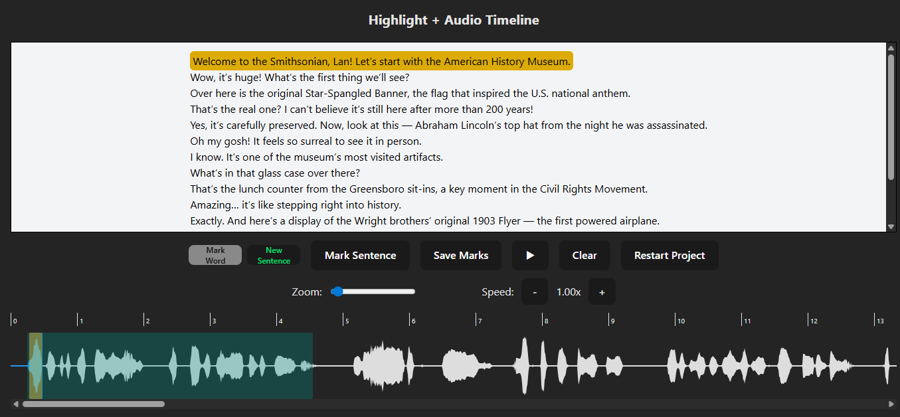

# Trình đánh dấu timestamp & highlight (smithsonian)

> Dự án xây dựng công cụ web để **đánh dấu thời điểm phát (ms)** cho **câu** và **từ**, xuất ra JSON theo format yêu cầu, và **phát lại kèm highlight**.

---

## 1. Giới thiệu
Dự án này là một ứng dụng cho phép phát audio kèm theo tính năng đồng bộ văn bản. Hệ thống sử dụng file .ogg chứa âm thanh và file jameslan.json lưu trữ mốc thời gian, giúp hiển thị và đánh dấu từng câu, từng từ trong câu theo tiến trình phát, sau đó phát lại các audio đánh dấu kèm hightlight từ

---

## 2. Mục tiêu
- Đánh dấu **chính xác đến millisecond**.  
- Thao tác **zoom/scroll timeline** mượt trên file dài, từ ngắn.  
- Giao diện **nghe – tạm dừng – đặt mốc**.  
- Xuất/nhập **JSON đúng schema** để tái sử dụng cho việc phát & highlight.  
- Dễ khởi chạy, không phụ thuộc backend phức tạp (chạy thuần trình duyệt). 

---

## 3. Công nghệ sử dụng
- Vue 3, JavaScript, TailwindCSS  
- Thư viện **WaveSurfer.js** để biểu diễn waveform, zoom và scrub.
- **Local Storage / Pinia** để lưu các file text, audio gốc và sau khi cắt.  

---

## 4. Luồng hệ thống
Dự án cung cấp một workflow đầy đủ:

  **Nhập file**: người dùng nạp `smithsonian.ogg` (âm thanh) và `smithsonian.txt` (văn bản gốc).
  **Biên tập (Edit)**: nghe –  
   - **Zoom timeline** theo mili-giây để đánh dấu chính xác.  
   - **Hightlight câu**: click chọn 1 câu muốn đánh dấu, sau khi đánh dấu câu đó xong sẽ click đúp vào từng từ trong câu, sau đó đánh dấu từ đó (chỉ cho phép đánh dấu từ trong câu hiện tại, cần đánh câu mới sẽ click "new sentence"). Lặp lại thao tác click đúp các từ tiếp theo và tiếp tục đánh dấu (từng từ 1) là hoàn thành xong 1 câu.
   - Bỏ qua **tên người nói** khi xác định vị trí ký tự đầu câu (`b`) và độ dài (`e`).  
   - Hỗ trợ **Clear** (Xóa toàn bộ hightlight, mark), **Restart project** (Tạo project với file text/audio mới), **Save mark** (Lưu file json các timing của câu/từ đã đánh dấu, ghép các đoạn audio đã đánh dấu trên timeline và chuyển hướng đến **Trang Phát Hightlight**).  
   - **Trang Phát Hightlight**: chuyển sang giao diện phát dựa trên các mốc đã lưu, **highlight theo thời gian** ở cấp độ từng từ (mô phỏng “bài 01”).

Kết quả là 1 file JSON gồm 2 khối: `sentence` (mảng các câu) và `word` (mảng các từ, theo thứ tự phát).

---

## 5. Giao diện cơ bản
  **Màn hình 1 – Nhập file**
  - Chọn file: smithsonian.ogg + smithsonian.txt.
  - Nút Next → Edit khi đủ file.
  **Màn hình 2 – Edit (đánh dấu)**
  - Waveform + playhead + zoom slider + speed audio.
  - Chi tiết câu: hiển thị văn bản, đánh mốc câu và từ, xác định màu cho vùng đánh dấu câu và các từ trong câu.
  - Nút: Play/Pause, Clear, Restart, Save mark.
  **Màn hình 3 – Phát + Highlight**
  - Hiển thị câu, highlight chi tiết từ đang phát.
  - Thanh tiến trình đồng bộ với audio.

---

## 6. Demo (Mô phỏng)
- **Link Demo**: Bạn có thể xem demo tại [đây](https://hightlight-b4.netlify.app/editor).

- **Video Demo**:
[Demo video](./demo-b4-new.mp4)

- **Hình ảnh Demo**:

